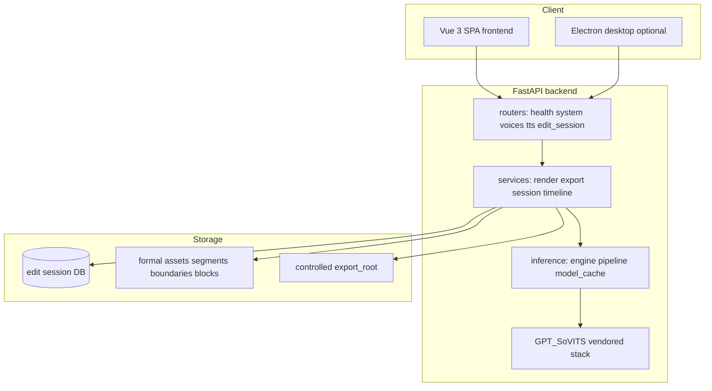

# Architecture

## Layered view

## Critical paths

1. **Edit session mutation** — HTTP → `edit_session` router → `EditSessionService` / `RenderJobService` → `RenderPlanner` + `EditableInferenceGateway` → asset store + repository. Snapshot shape: `DocumentSnapshot` / `EditableSegment` in `backend/app/schemas/edit_session.py`.
2. **Inference** — `PyTorchModelCache` + `PyTorchInferenceEngine` (`backend/app/inference/`) wrapping GPT-SoVITS modules; progress and cancellation policies in `backend/app/inference/progress_policy.py` and related services.
3. **Timeline / playback** — `TimelineManifestService`, `PlaybackMapService`, `CompositionBuilder` assemble block/segment audio for streaming and export.

## Risk hotspots

- **Schema drift** — `EditableSegment` uses **stem + terminal** fields; older tests or clients assuming `raw_text` on segment models will break (use `display_text` or the API’s JSON fields).
- **Export path safety** — Export `target_dir` must be **absolute** and under `EditAssetStore.export_root` (enforced in `ExportService._create_export_job`).
- **Heavy optional tests** — `backend/tests/e2e/` requires `GPT_SOVITS_E2E=1` and real weights; default CI excludes `e2e` marker.

## Deferred / legacy

- ONNX / TensorRT dependencies appear in `pyproject.toml` as a **legacy baseline** (see comments there and in `requirements.txt`).
- Root `tests/test_onnx_sampling.py` is **ignored** (missing `run_onnx_inference`); see `conftest.py` at repo root.
